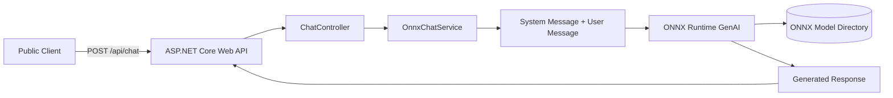

# ONNX Chat API

ASP.NET Core Web API that hosts an ONNX GenAI model and exposes a public chat endpoint with Swagger.

## Architecture



## Features

- ASP.NET Core Web API
- Swagger / Swashbuckle
- ONNX Runtime GenAI
- Configurable system prompt
- Public HTTP endpoint
- Dependency Injection
- Strongly typed configuration

## Project Structure

```text
ChatAPI/
├── Controllers/
│   └── ChatController.cs
├── Models/
│   ├── ChatRequest.cs
│   └── ChatResponse.cs
├── Options/
│   └── OnnxGenAIOptions.cs
├── Services/
│   ├── IChatService.cs
│   └── OnnxChatService.cs
├── docs/
│   ├── API.md
│   ├── MODEL.md
│   └── SECURITY.md
├── appsettings.json
├── Program.cs
└── OnnxChatApi.csproj
```

## Requirements

- .NET 8
- ONNX Runtime GenAI
- A GenAI-compatible ONNX model

## Configuration

Update `appsettings.json`:

```json
{
  "OnnxGenAI": {
    "ModelPath": "./models/phi",
    "SystemMessage": "You are a helpful assistant.",
    "MaxLength": 512,
    "Temperature": 0.7,
    "TopP": 0.9
  }
}
```

## Running

Restore packages:

```bash
dotnet restore
```

Run:

```bash
dotnet run
```

Open Swagger:

```text
http://localhost:5000/swagger
```

## Example Request

```http
POST /api/chat
Content-Type: application/json

{
  "message": "Explain ONNX Runtime."
}
```

## Example Response

```json
{
  "reply": "ONNX Runtime is..."
}
```
