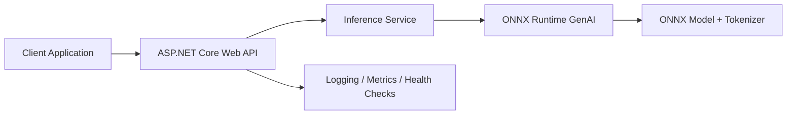

# ONNX-API

ONNX-API is a .NET-based hosting pattern for serving an ONNX large language model behind an ASP.NET Core Web API. The goal is to make it straightforward to run an ONNX Runtime GenAI-powered model in cloud platforms such as Azure App Service and AWS Elastic Beanstalk while keeping the HTTP surface familiar to .NET teams.

## Why this project exists

- Host ONNX LLM inference behind a standard REST API.
- Use ASP.NET Core for routing, dependency injection, configuration, health checks, and cloud hosting integration.
- Use ONNX Runtime GenAI for model loading, prompt processing, token generation, and streaming responses.
- Keep deployment simple enough for managed web hosting environments.

## Architecture at a glance

- **ASP.NET Core Web API** is the application shell.
- **Inference services** translate HTTP requests into prompt-generation operations.
- **ONNX Runtime GenAI** performs tokenization, generation, and model execution.
- **The model assets** stay local to the deployed app instance or attached storage.

## Architectural relationship

ASP.NET Core Web API and ONNX Runtime GenAI play different roles:

1. **ASP.NET Core receives and validates requests** from callers.
2. **Application services shape prompts and generation options** into a format the model layer understands.
3. **ONNX Runtime GenAI executes inference** against the ONNX model and produces tokens.
4. **ASP.NET Core formats the result** as JSON or a streamed HTTP response.

See the detailed documentation:

- [Architecture overview](./docs/architecture-overview.md)
- [Request lifecycle](./docs/request-lifecycle.md)
- [Cloud hosting topology](./docs/cloud-hosting.md)

## Typical responsibilities

### ASP.NET Core Web API

- Expose chat/completions-style endpoints
- Manage dependency injection and app startup
- Handle authentication, authorization, and rate limiting
- Emit logs, health probes, and metrics
- Stream tokens back to clients over HTTP

### ONNX Runtime GenAI

- Load the ONNX model and tokenizer assets
- Configure generation parameters
- Maintain generation state for each request
- Produce tokens efficiently on CPU or GPU-backed hosts

## Cloud hosting model

This architecture fits managed web-hosting environments where a long-running ASP.NET Core process can keep model assets warm in memory:

- **Azure App Service**: useful when the model can be packaged with the application or mounted storage and the workload fits the selected plan.
- **AWS Elastic Beanstalk**: useful when you want a familiar ASP.NET Core deployment model with environment-based configuration.

In both cases, the deployment unit is the web application, while ONNX Runtime GenAI runs in-process inside the API host.

## Suggested runtime flow

1. Application starts.
2. The API host loads configuration and initializes inference dependencies.
3. ONNX Runtime GenAI loads the model once and keeps it ready for requests.
4. Clients send prompt requests to the API.
5. The API invokes the inference layer and returns generated output.

## Repository documentation

This repository currently contains the project README plus architecture notes:

- `README.md`
- `docs/architecture-overview.md`
- `docs/request-lifecycle.md`
- `docs/cloud-hosting.md`

## Use cases

- Internal copilots exposed through a private API
- Retrieval-augmented generation services hosted inside an existing .NET platform
- Lightweight LLM endpoints where ONNX deployment is preferred over a Python-serving stack

## Next steps

As the implementation grows, this README can be expanded with:

- setup instructions
- local development commands
- deployment walkthroughs
- example request/response payloads
