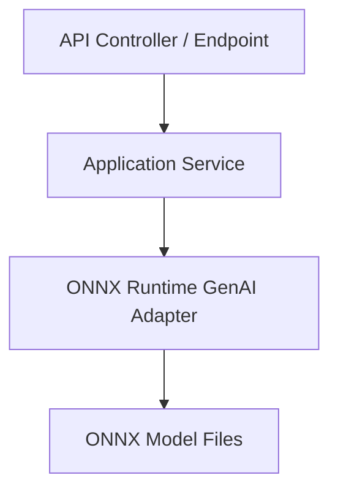

# Architecture overview

This document explains how ASP.NET Core Web API and ONNX Runtime GenAI fit together inside ONNX-API.

## Separation of concerns

ASP.NET Core Web API is responsible for the **service boundary**:

- HTTP endpoints
- request validation
- dependency injection
- configuration
- authentication and authorization
- health checks, logging, and observability

ONNX Runtime GenAI is responsible for the **model execution boundary**:

- loading ONNX model artifacts
- tokenization and prompt preparation
- generation settings
- iterative token generation
- returning model output to the application layer

## Component view

## Why this split works well

The ASP.NET Core layer lets the project look like a normal .NET cloud service, while ONNX Runtime GenAI keeps the inference logic close to the model runtime. That makes it easier to:

- deploy with standard ASP.NET Core hosting patterns
- isolate model-specific behavior from HTTP concerns
- test service logic separately from model execution concerns
- evolve the external API without tightly coupling it to runtime internals

## Recommended dependency flow

1. Register a singleton or long-lived service that owns model initialization.
2. Inject that service into API-facing application services.
3. Keep controllers thin and push prompt-building logic into service classes.
4. Return DTOs or streamed responses from the API layer instead of exposing runtime-specific objects directly.
