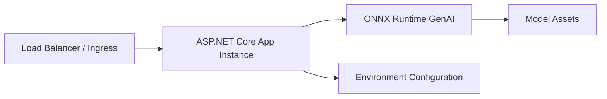

# Cloud hosting topology

This document explains how the ASP.NET Core host and ONNX Runtime GenAI are typically deployed together in managed cloud environments.

## In-process hosting model

ONNX-API is designed around an **in-process** model:

- ASP.NET Core runs as the web host
- ONNX Runtime GenAI runs inside the same application process
- model files are available to that process through local disk, mounted storage, or a deployment artifact

## Why this fits App Service and Elastic Beanstalk

Managed platforms are already optimized for long-lived web processes. ASP.NET Core provides the hosting abstraction, and ONNX Runtime GenAI becomes a library dependency inside the app. This means:

- the deployment story stays close to a standard .NET web app
- environment variables can control model paths and runtime settings
- health endpoints can report readiness based on model initialization

## Practical considerations

### Startup

Model initialization should happen during app startup or in a controlled warm-up path so that the first user request does not pay the full model-load cost.

### Scaling

Each application instance usually loads its own copy of the model. Horizontal scale therefore improves concurrency, but it also increases memory usage.

### Storage

Model artifacts can be:

- bundled into the deployment package when size allows
- mounted from shared storage
- downloaded during provisioning into local persistent storage

### Observability

Because ASP.NET Core owns the service boundary, standard web-service telemetry should remain in the API layer, with model timing and token metrics attached as inference-specific diagnostics.
