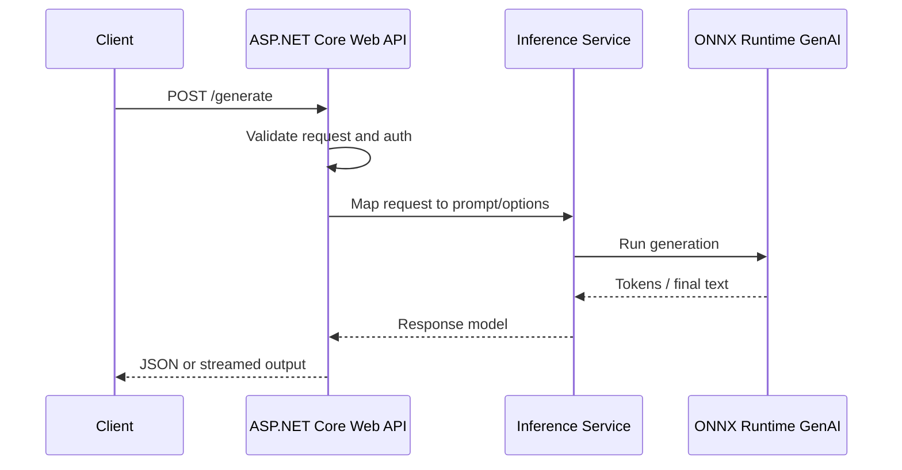

# Request lifecycle

This document focuses on the runtime relationship between a web request and ONNX Runtime GenAI inference.

## End-to-end flow

## What happens in each layer

### 1. API layer

The ASP.NET Core endpoint accepts the inbound payload, enforces any API-level rules, and maps the request into a format the application service understands.

### 2. Application service layer

The service decides how to:

- compose the final prompt
- apply defaults such as max tokens or temperature
- choose between buffered and streaming responses

### 3. ONNX Runtime GenAI layer

The runtime uses the prepared prompt and settings to execute generation against the loaded ONNX model.

### 4. Response layer

ASP.NET Core converts the generated result into the wire format expected by callers. That can be:

- a single JSON payload
- newline-delimited chunks
- token streaming over HTTP

## Operational note

The model runtime should be initialized once when possible, because repeated model loading can add significant latency. The API host should therefore treat the inference runtime as an application dependency rather than a per-request object.
